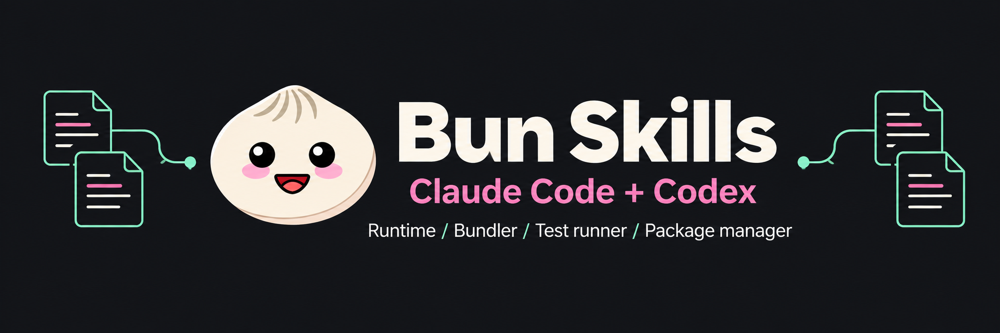

# bun-skills

[Bun](https://bun.com) documentation converted to AI agent skills, packaged as both Claude Code and Codex plugins. Both plugins use the same `skills/` directory and release version.

[Install](#install) | [App links and sharing](docs/installation.md) | [Maintenance](#updating-the-skills) | [Bun docs](https://bun.com/docs)

- **319 skills**, one per page in [bun.com/docs/llms.txt](https://bun.com/docs/llms.txt): runtime, bundler, test runner, package manager, and all 190 guides from [bun.com/guides](https://bun.com/guides).
- **`bun-guides-index`** lists every guide by category, so an agent can find the right guide skill.
- **Kept current with one command**: `bun run update` refreshes the live docs, regenerates both plugins and marketplaces, bumps their shared version when needed, and validates the result.

Community-maintained by [Brian Roach](https://github.com/itsbrex). Not an official Bun, Anthropic, or OpenAI plugin. The plugin contains documentation and branding only: no MCP server, credentials, companion app, or runtime service. Bun and Lightpanda are maintainer tools, not plugin-installation prerequisites.

## Install

Install once per agent; avoid also installing the individual skills into the same agent unless you want duplicate entries. Commands without a branch use the default branch. For changes still in a pull request, see [testing an unreleased branch](docs/installation.md#test-an-unreleased-branch).

### Claude Code plugin

Paste these commands into Claude Code, one at a time:

```text
/plugin marketplace add itsbrex/bun-skills
/plugin install bun-skills@bun-skills
```

Or from a terminal:

```sh
claude plugin marketplace add itsbrex/bun-skills
claude plugin install bun-skills@bun-skills
```

Start a new session after a terminal install, or run `/reload-plugins` in an existing session. The interactive installer lets you choose the scope; the terminal command defaults to user scope.

[Open Claude Code setup](claude-cli://open?repo=itsbrex%2Fbun-skills&q=%2Fplugin%20marketplace%20add%20itsbrex%2Fbun-skills) | [Claude setup and sharing instructions](docs/installation.md#claude-code-links)

The app link prefills the marketplace command for review; it does not send or install anything. GitHub strips custom app-link schemes, so use the code blocks or the [local link page](docs/installation.md#local-clickable-link-page).

### Codex plugin

```sh
codex plugin marketplace add itsbrex/bun-skills
codex plugin add bun-skills@bun-skills
```

For a local checkout, run `codex plugin marketplace add .` from this repository, then `codex plugin add bun-skills@bun-skills`. Start a new Codex task after installation. The repository catalog is `.agents/plugins/marketplace.json`; its local source is `./` because the repository root is the plugin.

Codex displays the Bun icon, light/dark logo, publisher, descriptions, category, brand color, and three starter prompts. The plugin ships documentation and assets; it has no MCP server, account setup, or companion app.

To view this in the Codex app:
[View bun-skills](docs/installation.md#view-bun-skills-in-codex) · [Share bun-skills](docs/installation.md#share-bun-skills-from-codex)

These GitHub-safe links lead to the matching setup steps. Actual Codex View/Share links require an absolute local marketplace path. From a clone, this creates a clickable page for **your** checkout without committing a maintainer's machine-specific path:

```sh
bun run plugin:links --open
```

The helper neither installs nor publishes the plugin. Without `--open`, it prints Markdown links; `--html` saves the page without opening a browser. See [installation, app links, and sharing](docs/installation.md) for details.

### Other agents

```sh
npx skills add itsbrex/bun-skills
```

Repository-only maintainer skills are marked internal and are not part of the published `skills/` collection.

### Update an installed plugin

Claude Code:

```sh
claude plugin marketplace update bun-skills
claude plugin update bun-skills@bun-skills
```

Codex:

```sh
codex plugin marketplace upgrade bun-skills
codex plugin add bun-skills@bun-skills
```

These refresh Git-backed installations. For local sources, update the checkout and reinstall from it. Start a new session/task afterward. Repository sync does not refresh global agent caches.

## Skills

Ask your agent normally, naming Bun Skills when you want to make the source explicit:

```text
Use Bun Skills to build a Bun HTTP server.
Use Bun Skills to write and run tests with bun test.
Use Bun Skills to migrate this project to Bun.
```

Each skill contains a documentation page, not a new executable tool. Agents select relevant skills from names and descriptions, then load the full reference. The large catalog has a context cost; use `claude plugin details bun-skills@bun-skills` to inspect the estimate for your installed version.

| Area | Examples |
| --- | --- |
| Runtime | HTTP, WebSockets, files, SQL, SQLite, S3, workers, shell, Node.js compatibility |
| Bundler | Builds, CSS, loaders, plugins, executables, full-stack apps |
| Test runner | Assertions, mocks, snapshots, coverage, parallel tests |
| Package manager | Install, workspaces, catalogs, lockfiles, registries, security |
| Guides | Frameworks, deployment, HTTP, streams, binary data, file I/O |

Each skill directory is `bun-` plus the docs path with `/` replaced by `-`:

| Docs page | Skill |
| --- | --- |
| `runtime/http/server` | `bun-runtime-http-server` |
| `bundler/css` | `bun-bundler-css` |
| `test/parallel` | `bun-test-parallel` |
| `guides/http/sse` | `bun-guides-http-sse` |

Skill names follow `Bun <page title>` (for example `Bun WebView`) and descriptions come from llms.txt.

## Updating the skills

Requirements: [Bun](https://bun.com) 1.3 or later. The Lightpanda browser runs on macOS and Linux; on other platforms sync reads the guides page with a plain fetch instead.

CI pins Bun 1.3.14. Both `claude` and `codex` CLIs are needed only for native plugin validation. For read-only checks, use `bun install --frozen-lockfile --ignore-scripts` so postinstall cannot repair drift before validation.

The repository pins the [hoisted linker](https://bun.com/docs/pm/isolated-installs) in `bunfig.toml`: the locked `bun-types` package imports transitive `undici-types` declarations that are not resolvable through an isolated global store. This keeps fresh installs and CI typechecks consistent without changing dependency versions.

```sh
bun install              # also regenerates both plugins and downloads Lightpanda if missing
bun run update --dry-run # preview docs and the resulting plugin version, without writing them
bun run update           # regenerate skills and both plugins, then validate
bun run validate         # must report problems: 0
```

In Claude Code, open this repo and run `/sync-bun-skills` or `/validate-bun-skills`. These maintainer skills walk through the preview, warning triage, validation, version bump, and commits.

### How sync works

1. Fetch [llms.txt](https://bun.com/docs/llms.txt) and download each page's markdown export (`https://bun.com/docs/<path>.md`). Section landing pages come from `<section>.md`.
2. Render [bun.com/guides](https://bun.com/guides) with the [Lightpanda](https://lightpanda.io) browser (downloaded by `bun install` through the pinned `@lightpanda/browser` package) to read the guide categories for `bun-guides-index`. If Lightpanda fails, fall back to a plain fetch, then to titles derived from guide paths.
3. Write `SKILL.md` files whose content changed and report stale skills.
4. Regenerate both plugin manifests and both marketplace catalogs from `plugin.config.json`. Record content fingerprints in `.plugin-sync.json` and the run summary in `.cache/sync-report.json`.

### Shared plugin metadata and versions

Edit **`plugin.config.json`** to change publisher metadata, descriptions, prompts, or icon paths. Run `bun run sync:plugins` to update both plugins without fetching Bun documentation. `bun install`, `bun run sync`, and `bun run update` also run this generator automatically. Do not edit generated files in `.claude-plugin/`, `.codex-plugin/`, or `.agents/plugins/` by hand.

`.plugin-sync.json` is the committed release fingerprint, not a disposable cache. Changed skill membership bumps the minor version; changed skill content, metadata, or referenced assets bumps the patch version. Repeated syncs do not bump versions or rewrite unchanged files. Set a higher version in `plugin.config.json` before syncing for an intentional major release. Keep the config, fingerprints, manifests, and content in the same release commit. Failed documentation syncs leave the previous release fingerprint intact so a retry still detects partial changes.

`--dry-run` previews the version against downloaded content, including planned additions and pruning. `bun run sync:plugins --check` exits nonzero for missing or stale generated files without repairing them. CI installs dependencies with `--ignore-scripts`, then checks drift, types, regression tests, and local skill validity. Native Claude/Codex checks run locally with both CLIs installed; CI does not claim to run them.

These commands prepare repository releases. Publishing the commit and refreshing an installed marketplace/plugin remain explicit operations; generation does not push commits or change global plugin installations.

There is no scheduled upstream fetch. Automatic means both ecosystems regenerate together whenever setup or sync runs. README, `docs/`, and the documentation-only banner are outside the packaged-content fingerprint; they do not trigger a plugin version bump. Future schema changes still require updating the generator and its tests.

### Metadata and schema sources

Manifest fields follow the [Claude Code plugin reference](https://code.claude.com/docs/en/plugins-reference#plugin-manifest-schema), [Claude marketplace reference](https://code.claude.com/docs/en/plugin-marketplaces), and [OpenAI's Codex plugin specification](https://github.com/openai/codex/blob/main/codex-rs/skills/src/assets/samples/plugin-creator/references/plugin-json-spec.md), checked on 2026-09-14. `bun run validate:codex` also verifies this repository through the installed Codex app-server's read-only `plugin/read` method, including every skill and resolved icon path.

Claude supports `displayName` but does not document a plugin icon field. Codex presentation fields are populated from real project metadata and [unmodified official Bun assets](assets/README.md). The publisher's public GitHub profile does not list an email; project-specific hosted privacy/terms pages and real product screenshots are not available, so those optional fields are omitted. No example URLs, fabricated contacts, empty integration files, or placeholder screenshots are generated.

### Scripts

| Command | What it does |
| --- | --- |
| `bun run sync` | Regenerate skills and both plugins. Flags: `--dry-run`, `--prune`, `--no-browser`, `--concurrency N` |
| `bun run sync:plugins` | Regenerate both plugins from shared metadata and content fingerprints; `--dry-run` previews, `--check` checks drift |
| `bun run plugin:links` | Print local app links; `--html` saves an ignored page, `--open` also opens it; no install or publication |
| `bun run validate` | Check skills, llms.txt coverage, both plugins, metadata, versions, and assets. `--offline` skips coverage |
| `bun run validate:plugins` | Check generated metadata, both catalogs, fingerprints, and assets without either agent CLI |
| `bun run validate:claude` | Run Claude's strict manifest validators and its skill validator; requires `claude` |
| `bun run validate:codex` | Read both the Codex marketplace and plugin with the native loader; requires `codex` |
| `bun run validate:plugin` | Run shared checks and both native agent validators |
| `bun run update` | `sync`, then `validate`; forwards sync flags and skips validation after a preview or failed sync |
| `bun test scripts` | Run isolated release, metadata, asset, and recovery regression tests |
| `bun run typecheck` | Typecheck `scripts/` |
| `bun run lightpanda:install` | Download Lightpanda if missing |
| `bun run lightpanda:upgrade` | Download the latest Lightpanda nightly (stable 0.4.0 times out on bun.com) |

Run `bun run validate` and `bun run validate:plugin` before publishing.

### Repository layout

| Path | Role |
| --- | --- |
| `skills/bun-*/SKILL.md` | Generated Bun documentation, shared by both plugins |
| `plugin.config.json` | Authoritative metadata, version, prompts, and branding paths |
| `.plugin-sync.json` | Committed release state and content fingerprints |
| `.claude-plugin/` | Generated Claude manifest and marketplace |
| `.codex-plugin/plugin.json` | Generated Codex manifest |
| `.agents/plugins/marketplace.json` | Generated Codex marketplace, rooted at this repository |
| `scripts/lib/plugins.ts` | Metadata validation, asset checks, generation, and automatic versions |
| `scripts/lib/docs.ts`, `scripts/lib/guides.ts` | Docs parsing and skill rendering |
| `scripts/plugin-links.ts`, `scripts/lib/plugin-links.ts` | Machine-local app links and optional HTML page |
| `.claude/skills/` | Internal maintainer workflows, not plugin skills |
| `assets/` | Official icons, generated cover, and provenance |
| `.cache/` | Ignored sync report and local app-link page |

### Verification and recovery

```sh
bun run typecheck
bun test scripts
bun run sync:plugins --check
bun run validate
bun run validate:plugin
git diff --check
```

The [CI workflow](.github/workflows/validate.yml) runs on pushes, pull requests, and manual dispatch. It checks types, tests, manifest drift, and offline skill validity using pinned actions and Bun. It does not fetch live docs or run native agent CLIs. Native validation does not install either plugin; the Codex check starts its app-server, reads the local plugin, checks every skill and icon path, then stops the process.

- A dry run still writes `.cache/sync-report.json`. Read `created`, `updated`, `failed`, `stale`, `warnings`, `guidesSource`, and `plugins`; a missing report after a crash is not success.
- Failed pages retain existing skills. Rerun transient failures with `--concurrency 4`; failed syncs preserve the old release fingerprint so retries detect partial writes.
- Use `--prune` only after reviewing stale paths. The generator refuses pruning when stale directories exceed 10% of upstream pages.
- Upgrade Lightpanda to the nightly when browser rendering fails. If neither browser nor fetch provides guide categories, an existing index is preserved and reported as failed; first generation can derive category titles from paths with warnings.
- Fix duplicate or long skill names in `NAME_OVERRIDES` in `scripts/sync-skills.ts`, then regenerate. Never patch generated skills.
- Interrupted manifest writes are recoverable by rerunning `bun run sync:plugins`. A corrupt `.plugin-sync.json` must be recovered from the last known committed state after reviewing local changes, not deleted as a cache.

### Release checklist

1. Preview and apply changes. Triage failures and warnings; review pruning before using `--prune`.
2. Update README skill/guide counts when membership changes and command documentation when setup changes.
3. Run all verification commands above. Disclose skipped live coverage or missing native CLIs.
4. Commit packaged skills/assets, shared config, fingerprint, both manifests, and both catalogs together. Keep independent script/docs changes separate when useful.
5. Push and open a PR when authorized; inspect CI logs. Merge through normal review, then refresh each installed plugin and test in a new task/session.

## Credits

Documentation content comes from [bun.com/docs](https://bun.com/docs) by the Bun team. Original skill conversion by Jarle Mathiesen ([jarle/bun-skills](https://github.com/jarle/bun-skills)). Repository tooling is [MIT licensed](LICENSE).

Plugin icons use original Bun artwork. The cover is generated community-project artwork, not an official product screenshot. See [asset provenance and the cover prompt](assets/README.md).
